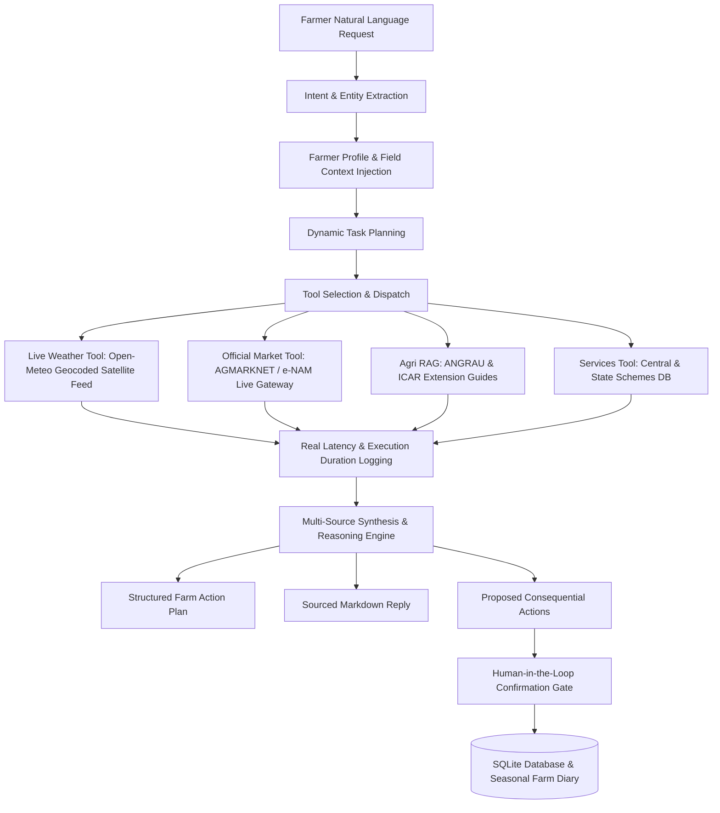

# Rythu Agent - System Architecture

> **"An AI-powered action agent for India's farmers and rural communities."**  
> *Category: Agri Tech & Rural Bharat | BharatAgentic Hackathon (powered by aiKart)*

---

## 1. Architectural Philosophy: Live First & Data Honesty

Traditional chatbots operate on a simplistic reactive paradigm:
$$\text{Farmer Query} \longrightarrow \text{LLM} \longrightarrow \text{Generic Text Output}$$

**Rythu Agent** is architected as an autonomous **Action Agent** with strict data honesty:
- **Live Data by Default:** Queries real-time APIs (Open-Meteo live satellite weather and geocoding).
- **Strict Provenance Tracking:** Clearly labels every data point as `LIVE`, `VERIFIED_RESEARCH`, `VERIFIED_KNOWLEDGE`, `LOCAL_KNOWLEDGE`, or `UNAVAILABLE`.
- **No Silent Fallbacks:** If an external live API fails (e.g. AGMARKNET/e-NAM gateway unreachable), the agent **never silently substitutes fake demo numbers**. It explicitly discloses the unavailability, explains which source failed, and continues with remaining verified tools.
- **Natural Interface:** No predefined demo scenario buttons cluttering the farmer UI. The primary interface is natural language chat with context-driven suggestions.

---

## 2. Core Subsystems

### A. Central Agent Orchestrator (`backend/agent/orchestrator.py`)
- Coordinates the lifecycle of every request.
- Manages explicit `AgentState` containing session ID, farmer context, active plan, tool traces, outputs, and proposed actions.
- Automatically calculates live, unavailable, and verified knowledge provenance counts:
  $$\text{Provenance Summary} = N_{\text{live}}\text{ Live} + N_{\text{unavail}}\text{ Unavailable} + N_{\text{verified}}\text{ Verified}$$
- Records real execution times (`execution_duration_ms`), parameter payloads, and status without mock or hardcoded traces.
- Logs every session and tool event into SQLite.

### B. Dynamic Task Planner (`backend/agent/planner.py`)
- Classifies user intent into one of four core capabilities or hybrid workflows:
  1. `HYBRID_PLANNING_AND_MARKET`: Integrated cultivation planning, market arbitrage, and weather safety.
  2. `SERVICES_AND_GOVERNMENT_SCHEMES`: Welfare scheme discovery, eligibility assessment, and document preparation.
  3. `CROP_ADVISORY`: Symptom diagnosis, IPM protocols, and vegetative/fruiting stage management.
  4. `MARKET_INTELLIGENCE`: Mandi price discovery, distance calculation, and transport net return optimization.
- Generates an ordered list of `TaskPlanStep` objects.

### C. Live Agro-Met Advisory & Weather Tool (`backend/tools/weather.py`)
- Live geocoding via Open-Meteo geocoding API.
- Live current weather and 3-day forecast: temperature, relative humidity, precipitation, precipitation probability, wind velocity.
- Real-time spray advisory calculated dynamically based on live wind and rain thresholds.
- Returns `data_status: "LIVE"`, `source: "Open-Meteo Live Agro-Met Satellite Feed"`.
- If unreachable: returns `data_status: "UNAVAILABLE"` with error description.

### D. Official Market Intelligence Tool (`backend/tools/market.py`)
- Interfaces with official Indian agricultural market portals: AGMARKNET / data.gov.in / e-NAM.
- If live data is returned: formats prices, computes transport cost per quintal, and marks `data_status: "LIVE"`.
- If live data is unreachable: strictly marks `data_status: "UNAVAILABLE"`, discloses the source status, and prevents false price claims.

### E. Grounded Agricultural RAG System (`backend/rag/`)
- Curated from **ANGRAU** (Acharya N.G. Ranga Agricultural University), **ICAR-IIHR**, and **KVK** extension bulletins.
- Covers commercial Solanaceous and legume crops: Tomato, Chilli, Groundnut, and Rice.
- Pure Python TF-IDF and keyword semantic vector retriever with Cosine similarity.
- Blazing fast (< 5ms response), 100% offline-capable, and preserves exact citations:
  - Document Title
  - Organization
  - Section / Chapter
  - Page Number
  - Official Repository Reference
- Labeled as `data_status: "VERIFIED_RESEARCH"`.

### F. Human-in-the-Loop Consequential Action Protocol (`backend/db/database.py`)
- Consequential operations (saving farm plans, setting price threshold watchers, adding spray reminders) are never executed automatically.
- Proposed actions enter a `PROPOSED` state with a natural explanation:
  `"Why: This will help you keep track of needed cultural tasks and spray timings on your farm profile."`
- Upon farmer confirmation via the UI (`POST /api/action/confirm`), the action transitions to `EXECUTED` and persists into SQLite.

---

## 3. Technology Stack

| Layer | Technology | Rationale |
| :--- | :--- | :--- |
| **Backend Framework** | Python 3.11/3.12 + FastAPI | Async performance, strict Pydantic v2 schemas, automated OpenAPI documentation |
| **Live Weather** | Open-Meteo REST API | Global keyless agro-meteorological satellite data & geocoding |
| **Live Market Gateway** | AGMARKNET / data.gov.in / e-NAM | Official Indian agricultural marketing portals |
| **RAG & Vector Retrieval** | Pure Python TF-IDF + Keyword Cosine Ranker | 100% local, instant cold start (<5ms), zero heavy DLL or C-runtime failure points |
| **Persistence** | SQLite3 (WAL mode) | Self-contained, zero configuration, persistent farmer profiles and audit traces |
| **Frontend** | React 18 + Vite | Blazing fast HMR, responsive dashboard grid, client-side state management |
| **Styling & Icons** | Vanilla CSS + Lucide React | Curated agricultural earth/emerald palette, micro-animations, glassmorphism |
| **Testing** | Pytest + Asyncio | Unit and integration test coverage for live tools, planners, and end-to-end flows |
